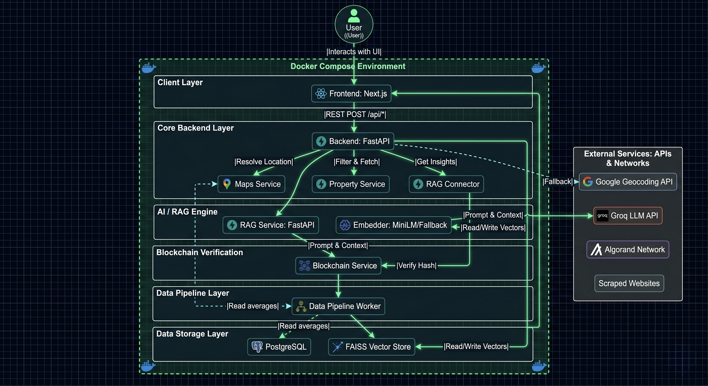
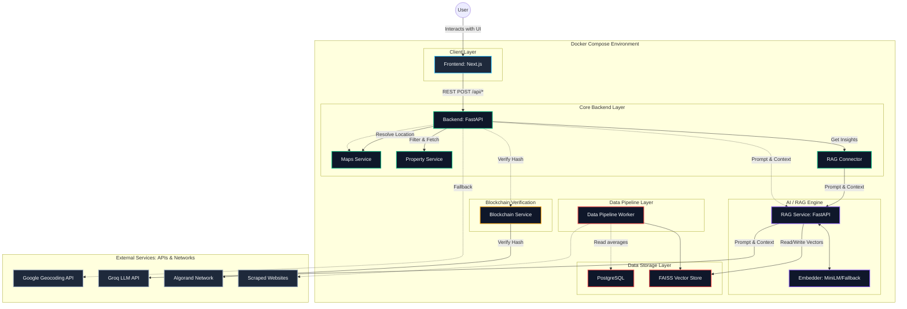

<div align="center">
  
  
  # 🏢 Real Estate AI Insights & Verification Platform

  **Transforming Real Estate with Intelligent AI and Immutable Blockchain Trust**

  [](https://nextjs.org/)
  [](https://fastapi.tiangolo.com/)
  [](https://docker.com/)
  [](https://algorand.com/)
  [](https://postgresql.org/)
</div>

---

An enterprise-grade, microservices-driven platform engineered to revolutionize property search, analysis, and verification. Built for the modern web, this system blends state-of-the-art **Retrieval-Augmented Generation (RAG)** for intelligent property insights with **Algorand Blockchain Technology** for immutable data integrity and trust.

---

## 📑 Table of Contents
<details>
<summary>Click to expand</summary>

- [Demo Preview](#-demo-preview)
- [Key Highlights](#-key-highlights)
- [Features](#-features)
- [Architecture](#-architecture)
- [Tech Stack](#-tech-stack)
- [Microservices Overview](#-microservices-overview)
- [AI & RAG Pipeline](#-ai--rag-pipeline)
- [Blockchain Verification Flow](#-blockchain-verification-flow)
- [Folder Structure](#-folder-structure)
- [Installation](#-installation)
- [Environment Variables](#-environment-variables)
- [Running with Docker](#-running-with-docker)
- [API Endpoints](#-api-endpoints)
- [Screenshots](#-screenshots)
- [Performance & Security](#-performance--security)
- [Future Improvements](#-future-improvements)
- [Troubleshooting & FAQ](#-troubleshooting--faq)
- [Contribution Guide](#-contribution-guide)
- [Authors](#-authors)

</details>

---

## 🎥 Demo Preview

*(Placeholder for Demo GIF/Video)*  
> ``

---

## 🚀 Key Highlights

- **Complex Microservices Architecture**: Decoupled, horizontally scalable services communicating seamlessly via REST API and orchestrated completely within Docker.
- **Advanced AI Integration**: Custom RAG pipeline using FAISS and Groq LLMs to empower users to "chat" directly with real estate data.
- **Web3 Meets PropTech**: Practical application of blockchain to solve real-world trust issues in real estate through immutable verification.
- **Robust Data Engineering**: Automated ETL pipelines handling data scraping, geospatial encoding, and deduplication continuously.

---

## ✨ Features

- **🧠 AI-Powered Contextual Insights**: Query property trends, neighborhood statistics, and amenities through a natural language interface.
- **🔗 Blockchain Auditing**: Every property listing is hashed and anchored to the Algorand blockchain to guarantee immutability.
- **🗺️ Interactive Geospatial Analysis**: Advanced map views, radius searching, and geographic filtering.
- **⚡ Blazing Fast UX**: Built on Next.js and Tailwind CSS for SSR, SEO optimization, and a seamless client-side experience.
- **🔄 Automated Data Ingestion**: Background workers scrape, validate, and vectorize property updates dynamically.

---

## 🏗️ Architecture

The application employs a cloud-native, domain-driven microservices layout.



### System Flowchart



---

## 💻 Tech Stack

| Layer | Technologies Used |
| :--- | :--- |
| **Frontend UI** | Next.js 14, React, TypeScript, Tailwind CSS, Zustand |
| **Core API Gateway** | Python, FastAPI, Pydantic, Uvicorn |
| **AI / RAG Engine** | Groq API, FAISS, MiniLM Embeddings, Langchain |
| **Blockchain** | Algorand SDK, PyTeal (Smart Contracts) |
| **Data Storage** | PostgreSQL, SQLAlchemy, FAISS Vector Store |
| **DevOps & Infrastructure** | Docker, Docker Compose, GitHub Actions |

---

## 🧩 Microservices Overview

- **Frontend (`/frontend`)**: Serves the user interface. Handles routing, state management, and maps rendering.
- **Backend API (`/backend`)**: The main gateway handling user requests, orchestrating interactions between the property database, maps, blockchain, and AI services.
- **RAG Engine (`/rag_engine`)**: A specialized, independent NLP service responsible for text chunking, embedding generation, semantic similarity search in FAISS, and final LLM answer synthesis.
- **Blockchain Service (`/blockchain`)**: An isolated service executing Algorand Web3 transactions and verifying PyTeal smart contracts.
- **Data Pipeline (`/data_pipeline`)**: Asynchronous workers and cron jobs dedicated to continuous data ingestion, cleaning, and indexing.

---

## 🤖 AI & RAG Pipeline

Our Retrieval-Augmented Generation approach avoids LLM hallucination by rooting answers in verified data.
1. **Ingestion**: Raw real-estate descriptions and statistics are chunked using semantic splitters.
2. **Embedding**: Chunks are processed via local MiniLM embeddings.
3. **Storage**: Vectors are indexed in FAISS for sub-millisecond retrieval.
4. **Retrieval**: User queries are embedded, matched in FAISS, and context is injected into a strict system prompt.
5. **Generation**: Groq's high-speed API processes the prompt and returns precise, data-backed insights.

---

## 🔗 Blockchain Verification Flow

To establish absolute trust, property verification data is anchored on the **Algorand Blockchain** using custom PyTeal smart contracts.

### `property_verification.py` (PyTeal Contract)
Acts as a decentralized registry for property data proofs.
- **State Variables Stored:**
  - `propertyId`: Unique identifier of the real estate listing.
  - `propertyHash`: Cryptographic hash of the property's metadata.
  - `documentHash`: Hash of the official legal/registration documents.
  - `walletAddress`: The Algorand wallet of the entity verifying the property.
  - `timestamp`: The exact epoch time of verification.
  - `creator`: The deployer's address enforcing strict access control.

*Workflow:* The `Blockchain Service` invokes a NoOp transaction to update the global state with property attributes, cryptographically proving data existed at that time and hasn't been tampered with.

---

## 📂 Folder Structure

```text
Real_estate/
├── backend/                # Core FastAPI handling business logic, routes, and DB
│   ├── app/                # Main application package
│   │   ├── config/         # App constants & settings
│   │   ├── db/             # PostgreSQL connection logic
│   │   ├── models/         # Pydantic Request/Response models
│   │   ├── routes/         # Endpoints (ai, property, search, verify)
│   │   └── services/       # Integrations (geo_service, rag_connector, blockchain_service)
├── blockchain/             # Algorand Smart Contracts and Web3 APIs
│   ├── scripts/            # Deployment scripts
│   ├── sdk/                # Algo client utilities
│   └── smart_contracts/    # PyTeal contracts (property_verification.py)
├── data_pipeline/          # Asynchronous workers for ETL
│   ├── collectors/         # Govt & Listing scrapers
│   ├── loaders/            # DB & Vector DB writers
│   └── processors/         # Deduplicator, Validator, Geo-encoder
├── docker/                 # Container definitions for all services
│   ├── backend.Dockerfile
│   ├── docker-compose.yml
│   └── frontend.Dockerfile
├── frontend/               # Next.js Application UI
│   ├── app/                # Next.js App Router pages and layouts
│   ├── components/         # Reusable UI (PropertyCard, Map, ChatBox, BlockchainBadge)
│   ├── lib/                # API helpers and custom hooks
│   └── store/              # Zustand state management
├── rag_engine/             # Dedicated LLM and Vector Engine
│   ├── embeddings/         # FAISS Vector store integration
│   ├── generation/         # LLM Client (Groq) and Prompts
│   ├── ingestion/          # Data chunkers and cleaners
│   └── retrieval/          # Ranker and retriever logic
└── shared/                 # Shared utilities like common loggers
```

---

## 🛠️ Installation

### Prerequisites
- [Git](https://git-scm.com/)
- [Docker](https://www.docker.com/products/docker-desktop) and Docker Compose
- Node.js (v18+) & Python (3.10+) (For local, non-docker development)

1. **Clone the Repository**
   ```bash
   git clone https://github.com/atharv0o/Real_estate.git
   cd Real_estate
   ```

---

## 🔐 Environment Variables

Create a `.env` file in the root directory. Configure the following keys:

```env
# AI Services
GROQ_API_KEY=your_groq_api_key

# Blockchain Identity
ALGORAND_MNEMONIC="your twenty five word mnemonic phrase..."
ALGORAND_NODE_TOKEN=your_algorand_node_token
ALGORAND_NODE_URL=https://testnet-api.algonode.cloud

# Database (Automatically mapped in Docker Compose)
POSTGRES_USER=postgres
POSTGRES_PASSWORD=postgres
POSTGRES_DB=realestate
```

---

## 🐳 Running with Docker

This project is built to be run entirely in Docker, mapping all microservice ports automatically.

1. **Build and Run All Services**
   ```bash
   docker-compose up --build -d
   ```
2. **Access the Application**
   - **Frontend UI**: [http://localhost:3000](http://localhost:3000)
   - **Backend API Docs**: [http://localhost:8000/docs](http://localhost:8000/docs)
   - **RAG Engine Docs**: [http://localhost:8001/docs](http://localhost:8001/docs)
   - **Blockchain Docs**: [http://localhost:8002/docs](http://localhost:8002/docs)

3. **Tear Down**
   ```bash
   docker-compose down -v
   ```

---

## 📡 API Endpoints

Our API adheres to OpenAPI specifications. Below are a few core examples.

### 1. Ask AI about a Property
```bash
curl -X 'POST' \
  'http://localhost:8000/api/ai/ask' \
  -H 'Content-Type: application/json' \
  -d '{
  "property_id": "12345",
  "question": "Is this property in a flood zone and what are the nearby schools?"
}'
```

### 2. Verify Property Blockchain Hash
```bash
curl -X 'GET' \
  'http://localhost:8000/api/verify/12345' \
  -H 'accept: application/json'
```

---

## 📸 Screenshots

<div align="center">
  
  
  <br/>
  
  
</div>

*(Note: Replace placeholders with actual application screenshots in `/docs`)*

---

## ⚡ Performance & Security

- **Scalability**: Docker Compose orchestration allows independent horizontal scaling of the RAG engine or frontend.
- **Latency Optimization**: FAISS index remains in memory for sub-10ms vector similarity lookups. 
- **Security**: 
  - Stateless JWT implementation (if integrated).
  - API Gateway limits exposure of the Blockchain and RAG microservices.
  - No sensitive PII is embedded into the blockchain; only non-reversible cryptographic hashes.

---

## 🔮 Future Improvements

- [ ] **Kubernetes Migration**: Translate `docker-compose.yml` into Helm charts for production K8s deployment.
- [ ] **Multi-Chain Verification**: Expand from Algorand to Polygon for cross-chain proof of existence.
- [ ] **Multimodal AI**: Allow users to upload images of properties and receive GenAI-driven structural analysis.

---

## ❓ Troubleshooting & FAQ

<details>
<summary><b>Docker containers fail to build?</b></summary>
Ensure Docker Desktop is running and you have sufficient memory allocated (minimum 4GB recommended for the RAG Engine).
</details>

<details>
<summary><b>Blockchain verification returns false?</b></summary>
Verify that your `ALGORAND_NODE_URL` is responsive and that the testnet node isn't rate-limiting your IP.
</details>

<details>
<summary><b>Groq API Errors?</b></summary>
Ensure your `GROQ_API_KEY` is valid and has not exceeded quota limits.
</details>

---

## 🤝 Contribution Guide

We welcome contributions from the community!

1. **Fork** the repository
2. **Clone** your fork locally
3. **Branch** off `main` (`git checkout -b feature/amazing-feature`)
4. **Commit** your changes (`git commit -m 'Add amazing feature'`)
5. **Push** to your fork (`git push origin feature/amazing-feature`)
6. **Open a Pull Request** against the `main` branch.

---

## 👥 Authors

- **Atharv Chivte** - [](https://www.linkedin.com/in/atharvchivate/)
- **Aseem Gulbarga** - [](https://www.linkedin.com/in/aseem-gulbarga-5704b12b0/)
- **Manoj Jeur** - [](https://www.linkedin.com/in/manoj-jeur-3845b02b0/)

---
<div align="center">
  <i>If you found this project helpful, please consider leaving a ⭐!</i>
</div>
